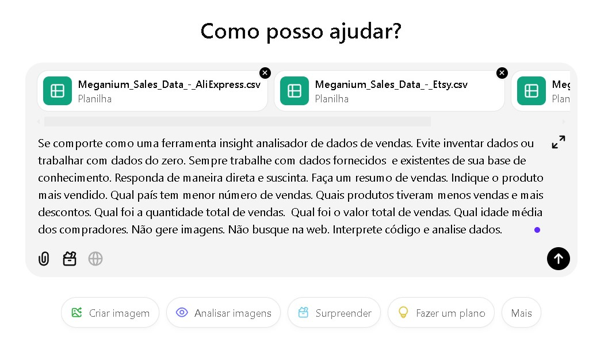
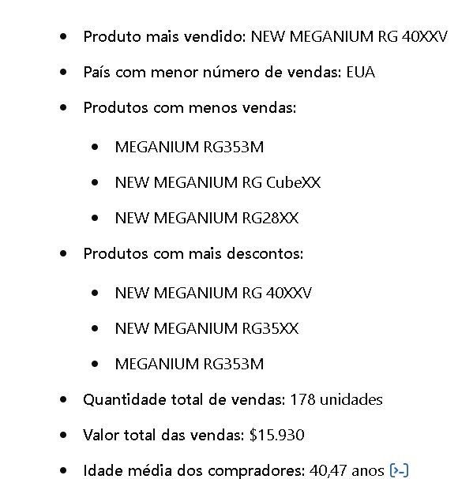

# Características.
- A empresa foca apenas em fabricação de consoles, deixando a distribuição e vendas para terceiros; 
- Os produtos são vendidos globalmente.

# Objetivos.
- [ ] Consolidar todas as bases de terceiros para realizar uma análise;
- [ ] Transformar dados de vendas sem informações relevantes para o fabricante;
- [ ] Quais os produtos são mais populares;
- [ ] Como otimizar o processo de transporte e logística até o momento da venda.

# Resultados esperados.
👉 Responda de maneira direta e suscinta.
👉 Faça um resumo de vendas. Indique o produto mais vendido.
👉 Qual país tem menor número de vendas.
👉 Quais produtos tiveram menos vendas e mais descontos.
👉 Qual foi a quantidade total de vendas.
👉 Qual foi o valor total de vendas.
👉 Qual idade média dos compradores.
👉 Não gere imagens.
👉 Não busque na web.
👉 Interpretar o código e analisar dados.

## Prompt acertivos .
- Código do produto: [sku]
- Nome do produto: [product_sold]
- Data da venda: [date_sold]
- Quantidade: [quantitaty]
- Preço por unidade: [unit_price]
- Preço total: [total_price]
- Moeda Corrente: [currency]
- Site: [site]
- Código de desconto: [discount_price]
- Valor do desconto: [discount_value]
- Aniversário do cliente: [buyer_birth_date]
- Nome do cliente: [buyer_name]
- País de entrega: [delivery_country]
- Nota fiscal: [invoice_id]

# Imagens geradas.

[ChatGPT] 

[ChatGPT Resultado] 

# Texto de retorno.

Resumo de Vendas:

## Produto mais vendido:
- NEW MEGANIUM RG 40XXV
## País com menor número de vendas:
- EUA
## Produtos com menos vendas:
  - MEGANIUM RG353M
  - NEW MEGANIUM RG CubeXX
  - NEW MEGANIUM RG28XX
## Produtos com mais descontos:
  - NEW MEGANIUM RG 40XXV
  - NEW MEGANIUM RG35XX
  - MEGANIUM RG353M
- Quantidade total de vendas: 178 unidades;
- Valor total das vendas: $15.930;
- Idade média dos compradores: 40 e 47 anos.